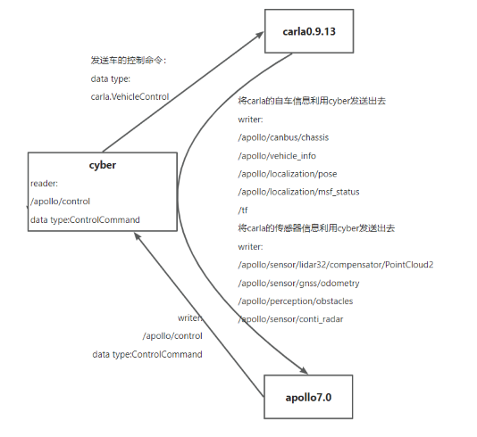

# apollo_carla_bridge
A simulation between apollo and carla.

<a name="readme-top"></a>


<!-- PROJECT LOGO -->
<br />
<div align="left">
  <!-- <a href="https://github.com/othneildrew/Best-README-Template">
    
  </a> -->

  <p align="left">
    <b>Carla & Apollo Co-simulation</b>
    <!-- <br /> -->
    <!-- <a href="https://github.com/othneildrew/Best-README-Template"><strong>Explore the docs »</strong></a>
    <br /> -->
    <br />
    <a href="">View Demo</a>
    ·
    <a href="https://github.com/yizhiweimengxiangfendoudefeifei/apollo_carla_bridge/issues">Report Bug</a>
    ·
    <a href="https://github.com/yizhiweimengxiangfendoudefeifei/apollo_carla_bridge/pulls">Request Feature</a>
    <br>
  </p>
</div>


<!-- ABOUT THE PROJECT -->
## About Carla Apollo Bridge
Carla Apollo Bridge aims to provide a data and control bridge for the communication between the latest version of Carla and Apollo. It was tested with Carla 0.9.13 and Apollo [master branch](https://github.com/ApolloAuto/apollo/commit/aa0c5eb66189b86a724206305712cfb337c07619) (newer than v7.0.0)  
## Data flow  
  

<!-- GETTING STARTED -->
## Getting Started

### Prerequisites

We will run Carla and Apollo in docker. Furthermore, NVIDIA Container Toolkit is needed. You can refer to the following link to install NVIDIA Container Toolkit:
* https://docs.nvidia.com/datacenter/cloud-native/container-toolkit/install-guide.html

Alternatively, simply perform the following steps：

* docker

  ```sh
  sudo apt-get install docker.io
  ```
* NVIDIA Container Toolkit

  ```sh
  curl https://get.docker.com | sh \
  && sudo systemctl --now enable docker
  ```
  ```sh
  distribution=$(. /etc/os-release;echo $ID$VERSION_ID) \
      && curl -fsSL https://nvidia.github.io/libnvidia-container/gpgkey | sudo gpg --dearmor -o /usr/share/keyrings/nvidia-container-toolkit-keyring.gpg \
      && curl -s -L https://nvidia.github.io/libnvidia-container/$distribution/libnvidia-container.list | \
            sed 's#deb https://#deb [signed-by=/usr/share/keyrings/nvidia-container-toolkit-keyring.gpg] https://#g' | \
            sudo tee /etc/apt/sources.list.d/nvidia-container-toolkit.list
  ```
  ```sh
  sudo apt-get update
  ```
  ```sh
  sudo apt-get install -y nvidia-docker2
  ```
  ```sh
  sudo systemctl restart docker
  ```

### Build And Run Apollo

* Refer to this link：
<br> https://github.com/ApolloAuto/apollo/blob/master/docs/quickstart/apollo_software_installation_guide.md

1. Clone the Apollo repo, please use guardstrike/apollo_carla_bridge branch
   ```sh
   # Using SSH
   git clone --branch guardstrike/apollo_carla_bridge git@github.com:yizhiweimengxiangfendoudefeifei/apollo.git

   #Using HTTPS
   git clone --branch guardstrike/apollo_carla_bridge https://github.com/yizhiweimengxiangfendoudefeifei/apollo.git
   ```
2. Build Apollo

   ```sh
   cd apollo
   echo "export APOLLO_ROOT_DIR=$(pwd)" >> ~/.bashrc  && source ~/.bashrc
   ```
   Then, run:
   ```sh
   bash docker/scripts/dev_start.sh
   ```
   to start Apollo development Docker container.
   <br>If you encountered an error, try:
   ```sh
   sudo rm -rf /apollo/.cache
   bash docker/scripts/dev_start.sh
   ```
   After the execution is successful, there will be the following output
   ```sh
   [ OK ] Congratulations! You have successfully finished setting up Apollo Dev Environment.
   [ OK ] To login into the newly created apollo_dev_lei container, please run the following command:
   [ OK ]   bash docker/scripts/dev_into.sh
   [ OK ] Enjoy!
   ```
   Run the command and enter the container:
   ```sh
   bash docker/scripts/dev_into.sh
   ```
   Make the GPU version:
   ```sh
   ./apollo.sh build_gpu
   ```
   After successful compilation, the following will be printed:
   ```sh
   ==============================================
   [ OK ] Done building apollo. Enjoy!
   ==============================================
   ```
   Run the command in the container:
   ```sh
   ./scripts/bootstrap.sh
   ```
   Finnaly, open the link in your browser:
   ```sh
   http://localhost:8888/
   ```

### Run Carla
* Download carla 0.9.13:
   ```sh
   # Choose CARLA_0.9.13.tar.gz
   https://github.com/carla-simulator/carla/releases/tag/0.9.13
   ```

* Install carla 0.9.13

   ```sh
   tar -zxvf CARLA_0.9.13.tar.gz
   echo "export PYTHONPATH=\$PYTHONPATH:/home/autopilot/CARLA_0.9.13/PythonAPI/carla/dist/carla-0.9.13-py2.7-linux-x86_64.egg" >> ~/.bashrc
   ```
* run carla
  
   ```sh
   cd CARLA_0.9.13
   ./CarlaUE4.sh
   ```

<!-- USAGE EXAMPLES -->
### Run apollo_carla_bridge
1.  Run and enter docker
    ```sh
    cd apollo_carla_bridge/docker
    ./build_docker.sh
    ./run_docker.sh
    docker exec -ti carla_cyber_0.9.13 bash
    ```
2.  Compile

    Run the following command in the container:
    ```sh
    ./apollo.sh build_cyber opt
    ```
    The following information is displayed after the compilation is successful:
    ```sh
    [INFO] Skipping revision recording
    ============================
    [ OK ] Build passed!
    [INFO] Took 61 seconds
    ```
3. Run

    Run the following command in the container.
    ```sh
    cd /apollo/cyber/carla_bridge
    python carla_cyber_bridge/bridge.py
    ```
    Start a new terminal and run:
    ```sh
    docker exec -ti carla_cyber_0.9.13 bash
    cd /apollo/cyber/carla_bridge
    python carla_spawn_objects/carla_spawn_objects.py
    ```
    Attention 
    in the carla_spawn_objects.py
    ```sh
    spawn_point_param = '0,0,0,0,0,180' # spawn vehicle at special position
    spawn_point_param = None # spawn vehicle at random position
    ```

### Result
If you successfully built and ran, you should see this in this video: 
 


## Usage
1. Open apollo client: http://localhost:8888
2. (Optional) Select "Task" in the sidebar and turn on "Camera Sensor" in "Others".
3. (Optional) Select "Layer Menu" in the sidebar and turn on "Point Cloud" in "Perception".
4. Select "Module Controller" in the sidebar and turn on "Routing" module.
5. Select "Route Editing" in the sidebar.
6. Click "Add Point of Interest" and left click at any point on the road to set the destination.
7. Click "Send Routing Request".
8. Select "Tasks" and click "Setup" to start co-simulation.


<!-- CONTRIBUTING -->
## Contributing

Contributions are what make the open source community such an amazing place to learn, inspire, and create. Any contributions you make are **greatly appreciated**.

If you have a suggestion that would make this better, please fork the repo and create a pull request. You can also simply open an issue with the tag "enhancement".
Don't forget to give the project a star! Thanks again!

1. Fork the Project
2. Create your Feature Branch (`git checkout -b feature/AmazingFeature`)
3. Commit your Changes (`git commit -m 'Add some AmazingFeature'`)
4. Push to the Branch (`git push origin feature/AmazingFeature`)
5. Open a Pull Request


<!-- LICENSE -->
## License

Distributed under the Apache-2.0 License. See `LICENSE.txt` for more information.

In addition, We have kept the LICENSE of project [Carla Apollo Bridge](https://github.com/AuroAi/carla_apollo_bridge) in carla_apollo_bridge directory.


<!-- ACKNOWLEDGMENTS -->
## Acknowledgments

The co-simulation is modified on the basis of the following, thank you here.

* [Apollo](https://github.com/ApolloAuto/apollo)
* [Carla Apollo Bridge cyber](https://github.com/AuroAi/carla_apollo_bridge)
* [Carla Apollo](https://github.com/guardstrikelab/carla_apollo_bridge)

<p align="right">(<a href="#readme-top">back to top</a>)</p>


